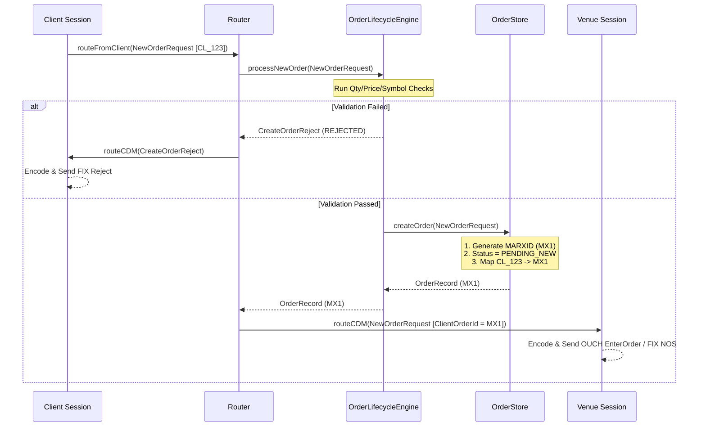
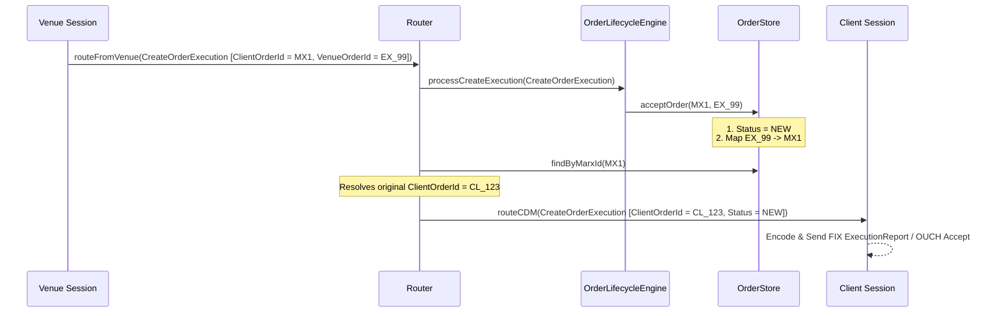

# Marx Execution Management System (EMS)

Marx is a low-latency, multi-protocol **Execution Management System (EMS)** designed to interface clients with financial venues. It provides an abstract, unified connection foundation supporting **FIX** and **OUCH** protocols, routing messages through a central **Common Data Model (CDM)** layer.

---

## High-Level Architecture

```text
                                +-------------------+
                                |    Client Layer   |
                                +---------+---------+
                                          | (FIX/OUCH)
                                          ▼
                                +---------+---------+
                                |  Client Sessions  |
                                +---------+---------+
                                          |
                                          | [Client -> CDM Conversion]
                                          ▼
                                +---------+---------+
                                |      Router       |
                                +---------+---------+
                                          |
                                          | [Process & Validate]
                                          ▼
                                +---------+---------+
                                |  LifecycleEngine  |
                                +---------+---------+
                                          |
                                          | [Query & Mutate]
                                          ▼
                                +---------+---------+
                                |    OrderStore     |
                                +---------+---------+
                                          |
                                          | [CDM Outbound Dispatch]
                                          ▼
                                +---------+---------+
                                |   Venue Session   |
                                +---------+---------+
                                          | (FIX/OUCH)
                                          ▼
                                +---------+---------+
                                |    Venue Layer    |
                                +-------------------+
```

---

## 1. How Client and Venue Sessions Load

Each session is configured via a `SessionContext` specifying connection parameters, credentials, and protocol properties. 

1. **Dedicated Event Thread**:
   - Every session instantiates its own dedicated `asio::io_context` running in a separate background thread. This isolates session operations and prevents blocking.
2. **Client Sessions (Outbound Connections)**:
   - Client sessions (like `FixClient` and `OuchClient`) extend `ClientSession`. On starting, they asynchronously resolve target endpoints and connect.
   - They handle reconnect schedules (with configurable exponential delays and max attempts) and initiate the logon handshake.
3. **Venue Sessions (Inbound Counterparties / Exchange Links)**:
   - Venue sessions extend `VenueSession`. They wait for the counterparty to initiate logon and do not reconnect on disconnect.
4. **Endpoint Registration**:
   - Upon connection active/logon success, sessions register themselves in the central `EndpointRegistry` so the `Router` can query them polymorphic-style for dispatch.

---

## 2. Inbound & Outbound Order Travels (End-to-End Flow)

### Outbound Path (New Order: Client -> Exchange)



### Inbound Path (Order Accepted: Exchange -> Client)



---

## 3. Order Lifecycle & Linked Versioning

To model replacements robustly, the `OrderStore` maintains linked version chains resembling Git commits.

### The Version Chain (Git-Commit Model)
Every replace creates a child order linking to its parent:

```text
    [Original Order]                 [Replaced Order]
       (MX000001)                       (MX000002)
   ┌────────────────┐               ┌────────────────┐
   │ ClOrdID: CL_01 │               │ ClOrdID: CL_02 │
   │ Status: REPLACED               │ Status: NEW    │
   │ successor: MX02├──────────────>│ parent: MX01   │
   └────────────────┘               └────────────────┘
```

- When a replace request is accepted, the parent order's status transitions to `REPLACED` and `LeavesQty` goes to `0`.
- The child order's status transitions to `NEW` and inherits any outstanding `CumQty`, `LeavesQty`, and `AveragePrice`.

### State Recovery on Reject
If a replace or cancel request is rejected by the exchange:
- The child order is transitioned to `REJECTED`.
- The parent order's status is restored to its previous active state (e.g. `NEW` or `PARTIALLY_FILLED`) and the `successor` link is removed, preserving the parent as the active leaf in lookups.

---

## 4. Operational Mappings (O(1) Searches)

To ensure low-latency lookups, the `OrderStore` maintains three hash maps:
- `ClientOrderID -> MARXID`: Resolves client-side identifiers to the internal session key.
- `VenueOrderID -> MARXID`: Resolves exchange-assigned identifiers (e.g., from fills or cancels).
- `ExecutionID -> MARXID`: Prevents duplicate fill processing by tracking trade IDs.

### Lookups: Specific vs. Active
- **`findByMarxId(marxId)`**: Returns the exact order version associated with that identifier (essential for processing specific historical events/fills).
- **`findActiveOrder(marxId)`**: Automatically traverses the parent-successor chain to find the latest active version of the order.
